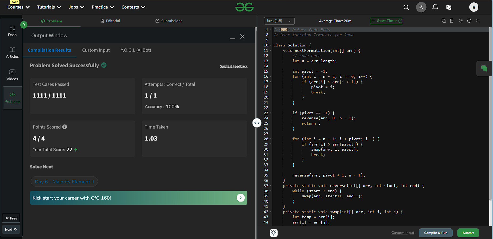

# Next Permutation

## Problem Understanding

### Problem Statement

Given an array of numbers, rearrange them into the **next permutation** in lexicographical order. If the array is in the largest permutation possible (sorted in descending order), rearrange it to the smallest permutation (sorted in ascending order).

### Understanding

The goal is to find the next lexicographically greater permutation of a given list of numbers. If no such permutation exists (i.e., the list is already in descending order), the list should be rearranged into the smallest possible permutation (ascending order).

### Example 

1. **Input**: `[1, 2, 3]`
   - Next permutation is `[1, 3, 2]`.

2. **Input**: `[3, 2, 1]`
   - This is the largest permutation. So, the output is the smallest: `[1, 2, 3]`.

3. **Input**: `[1, 1, 5]`
   - Next permutation is `[1, 5, 1]`.

### Key Observations:
- If the array is in descending order, there’s no next permutation, so we just return the smallest permutation (sorted in ascending order).
- If the array is already in the next permutation (e.g., `[1, 3, 2]` to `[2, 1, 3]`), the algorithm needs to find the next step.

---

## Approach

1. Iterate over the given array from the end and find the first index (pivot) which doesn't follow the property of a non-increasing suffix (i.e., `arr[i] < arr[i + 1]`).
2. If a pivot index does not exist, then the given sequence in the array is the largest as possible. So, reverse the complete array. For example, for `[3, 2, 1]`, the output would be `[1, 2, 3]`.
3. Otherwise, iterate the array from the end and find the successor (rightmost greater element) of the pivot in the suffix.
4. Swap the pivot and successor.
5. Minimize the suffix part by reversing the array from pivot + 1 till `n`.

## Algorithm Steps

1. **Find the first decreasing number**:
   - Loop through the list from right to left and find the first pair where `nums[i] < nums[i + 1]`. Let’s call this `nums[k]`.

2. **Find the smallest element greater than `nums[k]`**:
   - From the right side again, find the first element greater than `nums[k]`, and swap them.

3. **Reverse the suffix**:
   - Reverse the portion of the array after `k` to get the next smallest arrangement.

---

